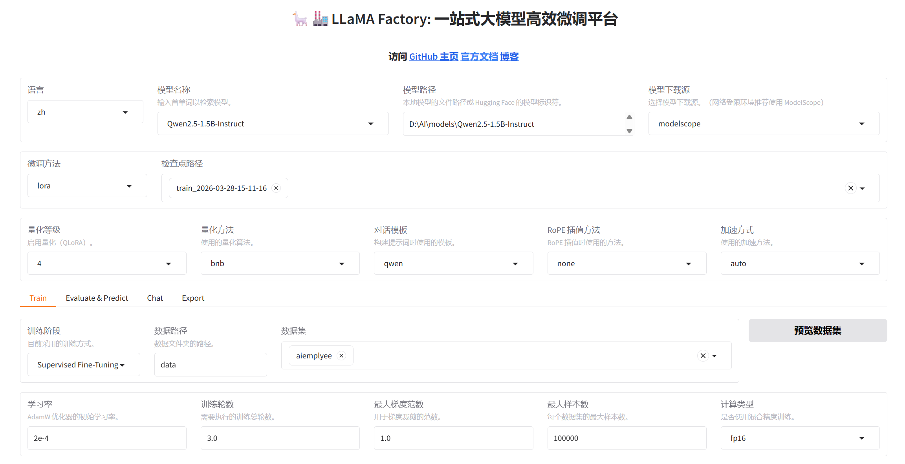
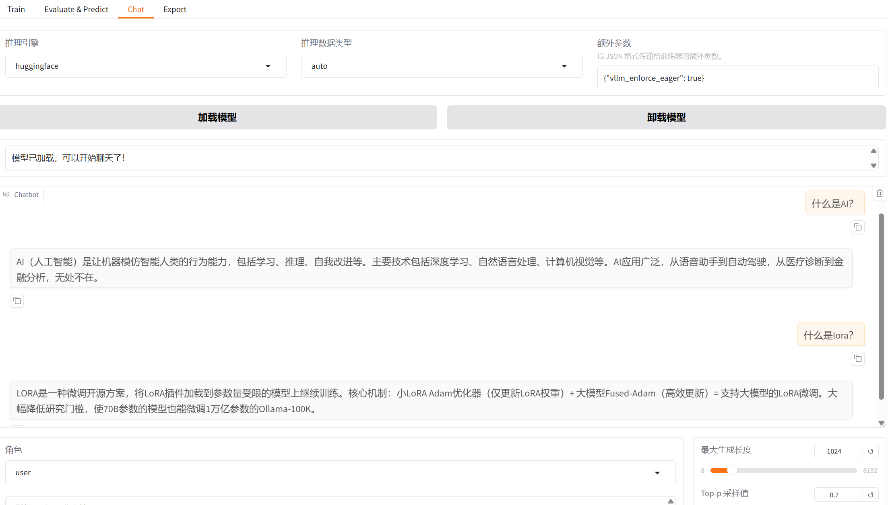
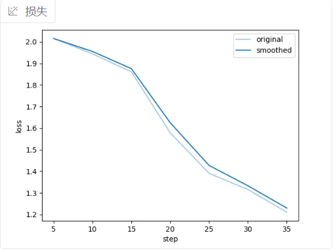
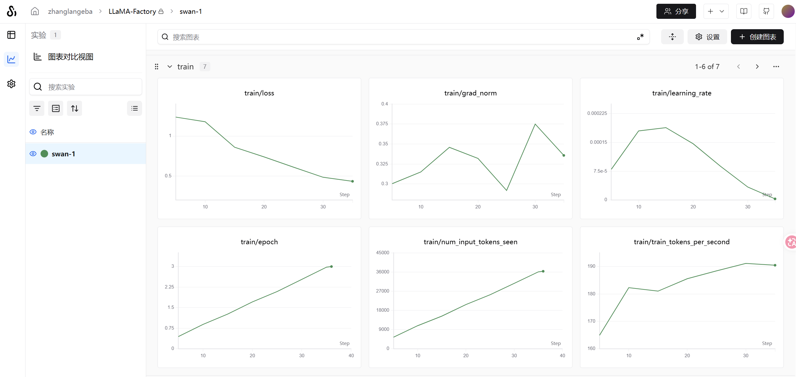

# Qwen2.5 QLoRA 微调 + vLLM 部署实践

## 项目简介
在 RTX 3060 6GB 笔记本上，完整实现了从数据准备、QLoRA微调到 vLLM 生产部署的全流程。

## 技术栈
- 基座模型：Qwen2.5-1.5B-Instruct
- 微调框架：LLaMA-Factory 0.9.5
- 微调方式：QLoRA（4-bit 量化 + LoRA）
- 推理部署：vLLM 0.18.0（OpenAI 兼容 API）
- 实验追踪：SwanLab(也可选wandb、mlflow)
- 运行环境：Windows 11 + WSL2 + CUDA 12.3

## 硬件配置
- GPU：NVIDIA RTX 3060 Laptop 6GB
- 系统：Windows 11

## 训练结果
| 指标 | 值 |
|------|-----|
| 训练 loss | 1.24 → 0.43 |
| 训练时长 | ~4 分钟 / 100条数据 |
| 可训练参数 | 920万（占总参数 0.59%）|

## 快速开始

### 1. 安装依赖

```bash
conda create -n lora python=3.11 -y
conda activate lora
cd LLaMA-Factory
pip install -e ".[torch,metrics]"
pip install swanlab
```

### 2. 准备数据

参考 `data/example.json` 格式准备训练数据，放到 `LLaMA-Factory/data/` 目录。

### 3. 开始训练



```powershell 
.\train.ps1
``` 

```bash
llamafactory-cli train `
    # 训练阶段：SFT 监督微调
    --stage sft `
    # 执行训练（而不是评估）
    --do_train True `
    # 基座模型路径
    --model_name_or_path D:\AI\models\Qwen2.5-1.5B-Instruct `
    # 数据预处理进程数，Windows 设 1 避免崩溃
    --preprocessing_num_workers 1 `
    # 微调方式：LoRA
    --finetuning_type lora `
    # 对话模板，Qwen 系列固定用 qwen
    --template qwen `
    # 注意力加速，auto 自动选择最优方案
    --flash_attn auto `
    # 数据集文件夹路径
    --dataset_dir data `
    # 使用的数据集名称（对应 dataset_info.json 里的 key）
    --dataset aiemplyee `
    # 最大序列长度，6GB 显存建议 512
    --cutoff_len 512 `
    # 初始学习率
    --learning_rate 0.0002 `
    # 训练轮数
    --num_train_epochs 3.0 `
    # 每个数据集最大样本数
    --max_samples 100000 `
    # 每张卡每步处理的样本数，显存小设 1
    --per_device_train_batch_size 1 `
    # 梯度累积步数，等效 batch_size = 1×8 = 8
    --gradient_accumulation_steps 8 `
    # 学习率调度策略，cosine 先升后降
    --lr_scheduler_type cosine `
    # 梯度裁剪，防止梯度爆炸
    --max_grad_norm 1.0 `
    # 每隔 5 步打印一次 loss
    --logging_steps 5 `
    # 每隔 100 步保存一次检查点
    --save_steps 100 `
    # 预热步数，学习率从 0 线性升到设定值
    --warmup_steps 10 `
    # 序列打包，关闭避免短样本被拼接
    --packing False `
    # 关闭 Qwen3 思考模式，Qwen2.5 不需要
    --enable_thinking False `
    # 实验追踪工具
    --report_to swanlab `
    # SwanLab 项目名称
    --swanlab_project qwen-medical `
    # 训练结果保存路径
    --output_dir saves\Qwen2.5-1.5B-Instruct\lora\train_2026-03-28 `
    # 使用 FP16 混合精度训练，节省显存
    --fp16 True `
    # 训练完自动绘制 loss 曲线图
    --plot_loss True `
    # 允许加载自定义模型代码
    --trust_remote_code True `
    # 分布式训练超时时间（单卡用不到但保留无害）
    --ddp_timeout 180000000 `
    # 记录实际处理的 token 数量
    --include_num_input_tokens_seen True `
    # 8-bit 分页优化器，比 adamw 省约 30% 显存
    --optim paged_adamw_8bit `
    # 梯度检查点，用时间换显存
    --gradient_checkpointing True `
    # 量化精度：4-bit
    --quantization_bit 4 `
    # 量化方法：bitsandbytes
    --quantization_method bnb `
    # 双重量化，进一步压缩显存
    --double_quantization True `
    # LoRA 秩，越大表达能力越强但显存更多
    --lora_rank 8 `
    # LoRA 缩放系数，通常 = 2×rank
    --lora_alpha 16 `
    # LoRA dropout，0 表示不丢弃
    --lora_dropout 0 `
    # LoRA 作用的模块，all 表示所有线性层
    --lora_target all `
    # 验证集比例，10% 数据用于评估
    --val_size 0.1 `
    # 评估策略：按步数评估
    --eval_strategy steps `
    # 每隔 100 步评估一次
    --eval_steps 100 `
    # 评估时每张卡的批大小
    --per_device_eval_batch_size 1
``` 



### 4. 导出模型

```powershell 
llamafactory-cli export `
    --model_name_or_path 你的基座模型路径 `
    --adapter_name_or_path 你的LoRA权重路径 `
    --template qwen `                # 对话模板，Qwen 系列固定用 qwen
    --finetuning_type lora `         # 微调方式：LoRA
    --export_dir 导出路径
    --export_size 5 `                # 导出模型大小，5 表示 5GB
    --export_legacy_format False `   # 导出为新格式
```

### 5. 启动 API 服务

```bash
# WSL2进入Ubuntu
wsl -d Ubuntu
source ~/vllm-env/bin/activate
python -m vllm.entrypoints.openai.api_server \
    --model 你的合并模型路径 \
    --host 0.0.0.0 \            # 允许所有 IP访问
    --port 8000 \               # 端口号   
    --max-model-len 1024 \      # 最大序列长度
    --gpu-memory-utilization 0.75 \  # GPU 内存利用率
    #--dtype bfloat16 \          # 数据类型，节省显存
    #--enforce-eager \           # 强制使用 eager 模式，解决显存问题
```

### 6. 调用 API

```bash
# curl 调用 API
curl http://localhost:8000/v1/chat/completions \
  -H "Content-Type: application/json" \
  -d '{"model": "/mnt/d/AI/models/Qwen2.5-1.5B-merged",
       "messages": [{"role": "user", "content": "你的问题"}]}'
```

```python
# python 调用 API
from openai import OpenAI
client = OpenAI(base_url="http://localhost:8000/v1", api_key="dummy")
response = client.chat.completions.create(
    model="你的模型名",
    messages=[{"role": "user", "content": "什么是大模型？"}]
)
print(response.choices[0].message.content)
```

## 踩坑记录
- Windows 多进程报错：`preprocessing_num_workers` 设为 1
- Python 3.10 不够：需要 3.11+
- 显存不足：加 `--enforce-eager` 参数
- vLLM tokenizer 报错：从原始模型复制 tokenizer 文件覆盖

## 实验记录
SwanLab 训练可视化：https://swanlab.cn/@用户名/LLaMA-Factory  
不具备参考价值，数据自己随意写的，拿训练好的数据又重复训练好几次，过拟合。  

